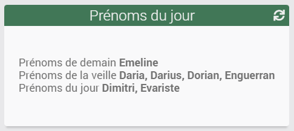

# Prémons du jour

## Description

Ce plugin permet d'obtenir plusieurs commandes afin de récupérer les prénoms/saints du jour du calendrier en France, ceux du jour précédent (la veille) et ceux du lendemain.
Le tout en local, sans connexion à internet.

## Configuration

Le plugin ne comporte pas de configuration générale.

## FAQ

> Est-ce que le plugin s'appuie sur des API externes ?

Non, les données sont incluses en local.

> Comment fonctionne le rafraichissement ?

Le plugin s'actualise une fois par jour à minuit (suivant l'heure de votre système).

## Contributions / Modification de la base de données des prénoms

Gardez en tête que toute modification effectuée directement sur votre installation sera forcément écrasée lors d'une mise à jour ultérieure.

Ce plugin gratuit est ouvert à contributions (améliorations et/ou corrections). N'hésitez donc pas à soumettre vos demandes via un Pull Request sur le [GitHub du plugin](https://jeanrobertjs.github.io/namesoftheday) ou via une demande sur le [forum Jeedom](https://community.jeedom.com/tag/plugin-namesoftheday).

## Disclaimer

Ce plugin ne prétend pas être exempt de bugs.
Ce plugin vous est fourni sans aucune garantie. Bien que peu probable, s'il venait à corrompre votre installation Jeedom, l'auteur ne pourrait en être tenu pour responsable.

## Changelog

Voir la page dédiée [ici](https://jeanrobertjs.github.io/jeedom_namesoftheday/fr_FR/changelog).
